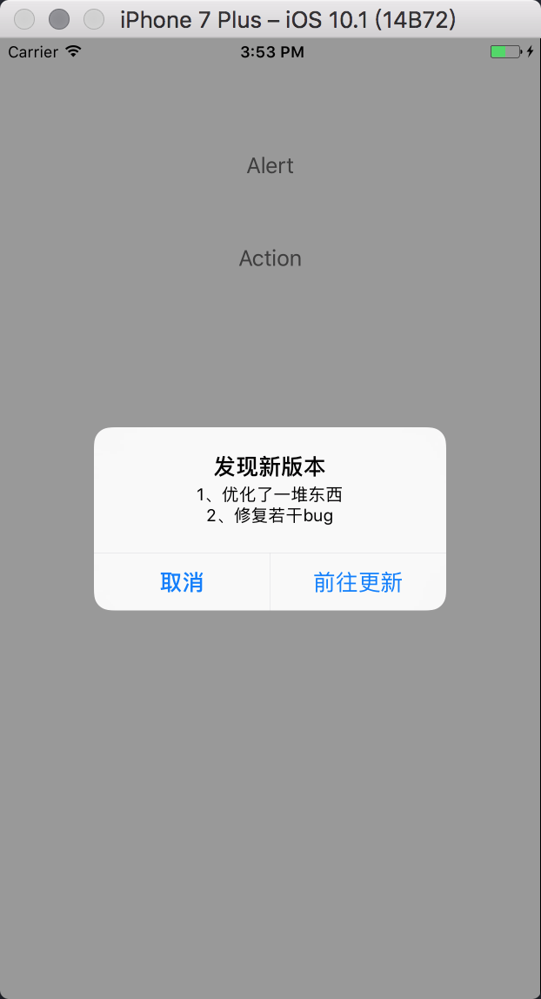
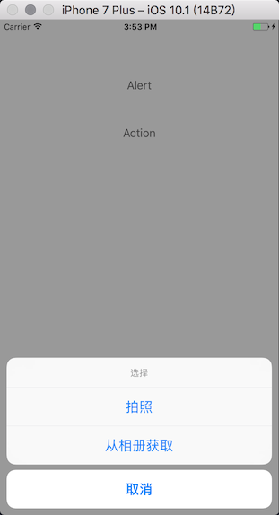

UIAlertControllerCustom

----------------------------------------------------------------------------------

项目中会用到好多系统的提示框, 系统的代码有点麻烦, 所以把两种常用的格式封装了一下, 自己用了一段时间,
觉得还是很好用的, 所以放上来分享一下
  



```  
    [self showAlertViewWithTitle:@"发现新版本" message:@"1、优化了一堆东西\n2、修复若干bug" cancelButtonTitle:@"取消" otherButtonTitles:@[@"前往更新"] handler:^(UIAlertController *alertController, UIAlertAction *action, NSInteger index) {
        switch (index) {
            case 0:
            {
                NSLog(@"取消");
            }
                break;
            case 1:
            {
                NSLog(@"前往更新");
            }
                break;
            default:
                break;
        }
    }];
```




``` 
    [self showActionViewWithTitle:@"选择" message:nil cancelButtonTitle:@"取消" otherButtonTitles:@[@"拍照", @"从相册获取"] handler:^(UIAlertController *alertController, UIAlertAction *action, NSInteger index) {
        switch (index) {
            case 0:
            {
                NSLog(@"取消");
            }
                break;
            case 1:
            {
                NSLog(@"拍照");
            }
                break;
            case 2:
            {
                NSLog(@"从相册获取");
            }
                break;
            default:
                break;
        }
    }];
```


